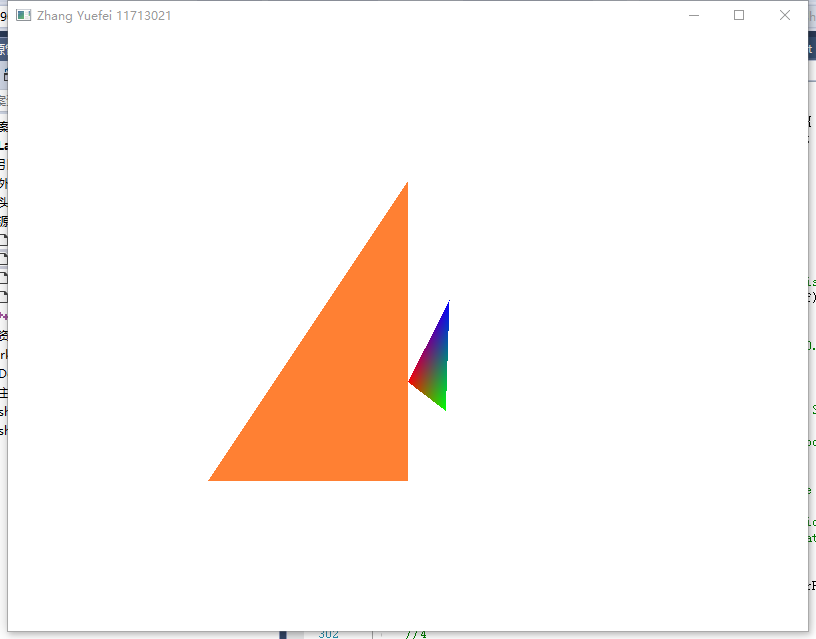

**Name**: 张跃飞
**SID**: 11713021
# Assignments
1. Finish example(draw a triangle). 
2. Try to draw 2 triangles next to each other using glDrawArrays by adding more 
vertices to your data 
3. Create two shader programs where the second program uses a different fragment 
shader that outputs some colors; draw both triangles again where one outputs 
some colors 
4. Draw a cube with color.
# Steps
1. Input Vertices 
1. Create VBO and VAO
1. Bind VBO and VAO
1. Analyze Vertex Attributes
1. Write the vertex shader and the fragment shader
1. Compile the shaders
1. Create a shader program object and link shaders to it
1. Draw a triangle in game loop

1. Change coordinates of the first three points to draw a smaller rectangular triangle.
1. Add another three point to `vertices[]` 
1. Use `glDrawArrays(GL_TRIANGLES, 3, 3);` to draw another triangle

1. Write some color fragment shader
1. Create another some color triangle class

1. Try MVP to change the viewing angle
    - Generating MVP
    ```
    // Projection matrix : 45° Field of View, 4:3 ratio, display range : 0.1 unit <-> 100 units
    glm::mat4 Projection = glm::perspective(glm::radians(45.0f), (float) width / (float)height, 0.1f, 100.0f);

    // Or, for an ortho camera :
    //glm::mat4 Projection = glm::ortho(-10.0f,10.0f,-10.0f,10.0f,0.0f,100.0f); // In world coordinates

    // Camera matrix
    glm::mat4 View = glm::lookAt(
        glm::vec3(4,3,3), // Camera is at (4,3,3), in World Space
        glm::vec3(0,0,0), // and looks at the origin
        glm::vec3(0,1,0)  // Head is up (set to 0,-1,0 to look upside-down)
        );

    // Model matrix : an identity matrix (model will be at the origin)
    glm::mat4 Model = glm::mat4(1.0f);
    // Our ModelViewProjection : multiplication of our 3 matrices
    glm::mat4 mvp = Projection * View * Model; // Remember, matrix multiplication is the other way around
    ```
    - Give MVP to GLSL
    ```
    // Get a handle for our "MVP" uniform
    // Only during the initialisation
    GLuint MatrixID = glGetUniformLocation(programID, "MVP");//programID should be the shader program
    
    // Send our transformation to the currently bound shader, in the "MVP" uniform
    // This is done in the main loop since each model will have a different MVP matrix (At least for the M part)
    glUniformMatrix4fv(MatrixID, 1, GL_FALSE, &mvp[0][0]);
    ```
    - Change the vertexShader.vert
    ```
    // Input vertex data, different for all executions of this shader.
    layout(location = 0) in vec3 vertexPosition_modelspace;
    
    // Values that stay constant for the whole mesh.
    uniform mat4 MVP;
    
    void main(){
    // Output position of the vertex, in clip space : MVP * position
    gl_Position =  MVP * vec4(vertexPosition_modelspace,1);
    }
    ```
    - Result
    
1. Input vertices and colors of the cube
1. Generate the cube


# Problems
1. Run-Time Check Failure #2 - Stack around the variable 'success' was corrupted.

    **Solution**: 
    ```
        int success;
        char infoLog[22];
        glGetShaderiv(vertexShader, GL_COMPILE_STATUS, &success);
        if (!success) {
            glGetShaderInfoLog(vertexShader, 512, NULL, infoLog);
            std::cout << "ERROR::SHADER::VERTEX::COMPILATION_FAILED\n" << infoLog << std::endl;
        }
    ```
    The char arrar `char infolog[22]` is out of bound for the following error infolog, so it should be changed to `char infolog[50]`.
2. When run the executable file, 

    **Solution**: Put the shader files in the same directory.
3. Why my program not need depth test??
    **Solution**: NULL